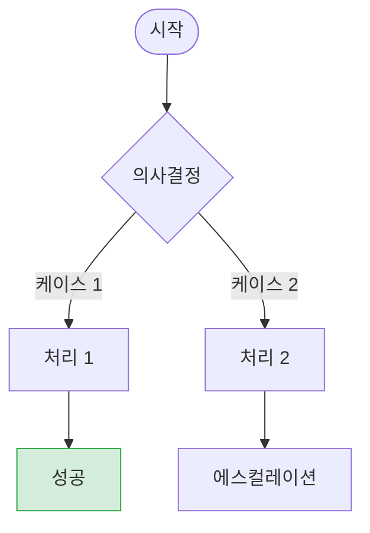

# Stage 4: Flowchart Generation

## Overview
This SOP guides the automatic generation of Mermaid flowcharts from SOP documents created in Stage 3. This is **Stage 4** (optional enhancement stage) of the Userchat-to-SOP pipeline, performed by the AI agent using natural language analysis and Mermaid diagram generation.

**Language:** All user interactions MUST be conducted in Korean (한국어). Questions, confirmations, and outputs should be in Korean unless the user explicitly requests English.

**Stage Flow:**
```
Input: Stage 3 SOP documents (03_sop/*.sop.md)
    ↓
Process: AI analysis of SOP structure
    ↓
Generate: Mermaid flowchart syntax
    ↓
Convert: SVG image generation (mmdc CLI)
    ↓
Output: Flowchart Markdown + SVG files
```

**Total Time**: 5-15 minutes (depends on number of SOPs)

## Parameters

### Required
- **sop_dir**: Directory containing Stage 3 SOP files
  - Example: `results/assacom/03_sop`
  - Must contain `.sop.md` files

### Optional
- **target_sops** (default: "all"): Which SOPs to generate flowcharts for
  - `"all"`: Generate for all TS (Troubleshooting) type SOPs
  - `"ts_only"`: Only Troubleshooting SOPs (recommended)
  - List: `["TS_001", "TS_003"]` - Specific SOP IDs

- **output_format** (default: "both"): Output file format
  - `"markdown"`: Mermaid markdown only
  - `"svg"`: SVG image only
  - `"both"`: Both markdown and SVG (recommended)

- **diagram_style** (default: "standard"): Flowchart complexity
  - `"simple"`: Basic decision tree (5-10 nodes)
  - `"standard"`: Balanced detail (15-30 nodes)
  - `"detailed"`: Full process with all cases (30+ nodes)

- **color_scheme** (default: "status"): Color coding strategy
  - `"status"`: Success (green), Warning (yellow), Error (red), Info (blue)
  - `"priority"`: High/Medium/Low priority
  - `"none"`: No color coding

## Steps

### 1. Validate Inputs

Verify Stage 3 SOP files and Mermaid CLI installation.

**Actions:**
- Check `sop_dir` exists and contains `.sop.md` files
- Verify Mermaid CLI is installed: `mmdc --version`
- If not installed, guide user to install: `npm install -g @mermaid-js/mermaid-cli`
- Count number of SOPs to process
- Filter by target_sops parameter

**Expected Output:**
```
✅ Stage 4 준비 완료
  - SOP 디렉토리: results/assacom/03_sop
  - 발견된 SOP: 7개 (TS: 4개, HT: 3개)
  - 처리 대상: 4개 (TS만)
  - Mermaid CLI: 설치됨 (v11.12.0)
```

**Quality Checks:**
- [ ] SOP 디렉토리 존재 확인
- [ ] 최소 1개 이상의 SOP 파일 존재
- [ ] Mermaid CLI 설치 확인
- [ ] 출력 디렉토리 쓰기 권한 확인

### 2. Analyze SOP Structure

For each target SOP, analyze structure to extract flowchart components.

**Actions:**
- Read SOP file
- Identify SOP type (TS or HT)
- Extract sections:
  - "문제 해결 프로세스" or "내용"
  - "케이스 1, 2, 3..." sections
  - "에스컬레이션 기준"
- Parse case-by-case decision logic
- Identify condition checks and branches

**Analysis Template:**
```yaml
sop_id: TS_001
sop_type: Troubleshooting
title: AS 접수 및 하드웨어 진단
cases:
  - id: 1
    name: PC 갑자기 꺼지는 증상
    conditions: [로밍 OFF, 전원 문제]
    actions: [자가 진단, AS 접수]
    outcome: [해결, 미해결]
  - id: 2
    name: 블루스크린 발생
    ...
decision_points:
  - 증상 확인
  - 해결 여부 확인
  - AS 방법 선택
escalation:
  - 복합 증상 → AS 기술팀
  - 3회 이상 실패 → AS 기술팀
```

**Expected Duration:** 1-2 minutes per SOP

**Quality Checks:**
- [ ] 모든 케이스 추출 완료
- [ ] 의사결정 포인트 식별
- [ ] 에스컬레이션 기준 파악
- [ ] 분기 조건 명확히 정의

### 3. Generate Mermaid Flowchart

Convert analyzed structure into Mermaid flowchart syntax.

**Actions:**
- Create flowchart nodes:
  - Start node: `Start([고객 문의 접수])`
  - Decision nodes: `{증상 확인?}`
  - Process nodes: `[자가 진단 안내]`
  - End nodes: `End([처리 완료])`
- Define edges and conditions
- Apply color coding:
  - Success: `classDef successClass fill:#d4edda`
  - Warning: `classDef warningClass fill:#fff3cd`
  - Danger: `classDef dangerClass fill:#f8d7da`
  - Info: `classDef infoClass fill:#d1ecf1`
- Add legend and case descriptions

**Flowchart Structure:**


**Expected Output:** Mermaid markdown content (100-300 lines)

**Quality Checks:**
- [ ] 모든 케이스가 노드로 표현됨
- [ ] 분기 조건이 명확함
- [ ] 색상 코딩이 일관됨
- [ ] Mermaid 구문 오류 없음

### 4. Create Flowchart Markdown File

Write complete flowchart documentation with Mermaid chart.

**Actions:**
- Create file: `{SOP_ID}_FLOWCHART.md`
- Include sections:
  - Title and description
  - Mermaid flowchart
  - Case explanations (color-coded)
  - Key checkpoints table
  - Escalation criteria
  - Generation metadata
- Add cross-reference to original SOP

**File Template:**
```markdown
# [{SOP_ID}] {Title} - 플로우차트

> 이 플로우차트는 {SOP_ID} SOP의 {purpose} 흐름을 시각화한 것입니다.

## 상담 흐름도

\```mermaid
flowchart TD
    ...
\```

## 케이스별 설명

### 🟢 정상 처리 (초록색)
- **케이스 1**: ...

### 🟡 주의 필요 (노란색)
- **케이스 2**: ...

### 🔴 에스컬레이션 (빨간색)
- **케이스 N**: ...

## 주요 체크포인트

| 단계 | 확인 사항 | 도구 |
|------|----------|------|
| ... | ... | ... |

---

**생성 정보**:
- 원본 SOP: [{SOP_ID}.sop.md](./{SOP_ID}.sop.md)
- 생성일: {date}
- 플로우차트 버전: v1.0
- 데이터: {count}건
```

**Expected Duration:** 2-3 minutes per SOP

**Quality Checks:**
- [ ] 파일명 형식: `{SOP_ID}_FLOWCHART.md`
- [ ] Mermaid 블록 정상
- [ ] 케이스 설명 완전
- [ ] 메타데이터 정확

### 5. Convert to SVG Image

Use Mermaid CLI to generate SVG images from Mermaid markdown.

**Actions:**
- Execute for each flowchart file:
  ```bash
  mmdc -i {SOP_ID}_FLOWCHART.md -o {SOP_ID}_flowchart.svg -b transparent
  ```
- Verify SVG file generation
- Check file size (should be 100-200KB)
- Validate SVG can be opened

**Expected Output:**
```
Found 1 mermaid charts in Markdown input
 ✅ ./TS_001_flowchart-1.svg
```

**Expected Duration:** 10-20 seconds per SOP

**Quality Checks:**
- [ ] SVG 파일 생성 성공
- [ ] 파일 크기 적절 (100-200KB)
- [ ] SVG 열기 가능
- [ ] 차트가 잘림 없이 표시됨

**Troubleshooting:**

If Mermaid CLI fails:
```bash
# Parse error: 큰따옴표 제거
# 노드 텍스트에서 " → ' 또는 제거

# Parse error: 이모티콘 제거
# :) → 제거 또는 이모지로 변경

# 재시도
mmdc -i file.md -o file.svg -b transparent
```

### 6. Generate Summary Report

Create summary of flowchart generation results.

**Actions:**
- Count generated files (markdown + SVG)
- Calculate total processing time
- List all generated flowcharts
- Provide viewing instructions
- Generate summary markdown

**Summary Template:**
```markdown
# Stage 4: Flowchart Generation Summary

## 실행 정보
- 회사: {company}
- 실행일: {date}
- 처리 시간: {duration}

## 생성 결과

### 플로우차트 생성
- 총 SOP 수: {total_sops}개
- 플로우차트 생성: {flowchart_count}개
- Markdown 파일: {flowchart_count}개
- SVG 이미지: {svg_count}개

### 파일 목록

| SOP ID | 제목 | Markdown | SVG 크기 |
|--------|------|----------|----------|
| TS_001 | AS 접수 | ✅ | 167KB |
| TS_003 | 취소/반품 | ✅ | 180KB |

## 플로우차트 확인 방법

### VSCode에서 SVG 직접 보기
1. SVG 파일 클릭
2. 자동으로 렌더링됨

### Markdown 프리뷰 (확장 필요)
1. VSCode 확장 설치: "Markdown Preview Mermaid Support"
2. `Cmd + Shift + V`로 프리뷰 열기

### 브라우저에서 보기
- SVG 파일을 브라우저로 드래그앤드롭

## 다음 단계

1. ✅ 플로우차트 확인 및 검토
2. SOP 문서에 플로우차트 링크 추가
3. 고객사에 전달
```

**Output File:** `{sop_dir}/flowchart_generation_summary.md`

**Quality Checks:**
- [ ] 모든 생성 파일 목록 포함
- [ ] 파일 크기 정보 정확
- [ ] 확인 방법 안내 포함
- [ ] 다음 단계 제시

### 7. Update Metadata

Update Stage 3 metadata.json to include flowchart references.

**Actions:**
- Read existing `metadata.json`
- Add flowchart information to each SOP entry:
  ```json
  {
    "sop_id": "TS_001",
    "flowchart": {
      "markdown": "TS_001_AS접수_하드웨어진단_FLOWCHART.md",
      "svg": "TS_001_flowchart-1.svg",
      "generated_at": "2026-02-04T15:30:00",
      "nodes": 25,
      "cases": 5
    }
  }
  ```
- Save updated metadata.json

**Quality Checks:**
- [ ] 메타데이터 JSON 형식 유효
- [ ] 모든 플로우차트 정보 포함
- [ ] 원본 메타데이터 보존

## Examples

### Example 1: Assacom Full Run

**Scenario**: Generate flowcharts for all Assacom Troubleshooting SOPs

**Parameters:**
```bash
sop_dir="results/assacom/03_sop"
target_sops="ts_only"
output_format="both"
diagram_style="standard"
color_scheme="status"
```

**Execution:**
```
📊 Stage 4: 플로우차트 생성 시작

1️⃣ 입력 검증
  - SOP 디렉토리: results/assacom/03_sop
  - 총 SOP: 7개 (TS: 4개, HT: 3개)
  - 처리 대상: 4개 (TS만)
  - Mermaid CLI: ✅

2️⃣ SOP 구조 분석
  - TS_001 분석 중... ✅ (5개 케이스)
  - TS_002 분석 중... ✅ (4개 케이스)
  - TS_003 분석 중... ✅ (6개 케이스)
  - TS_004 분석 중... ✅ (5개 케이스)

3️⃣ Mermaid 플로우차트 생성
  - TS_001_FLOWCHART.md ✅
  - TS_002_FLOWCHART.md ✅
  - TS_003_FLOWCHART.md ✅
  - TS_004_FLOWCHART.md ✅

4️⃣ SVG 이미지 변환
  - TS_001_flowchart-1.svg ✅ (167KB)
  - TS_002_flowchart-1.svg ✅ (152KB)
  - TS_003_flowchart-1.svg ✅ (180KB)
  - TS_004_flowchart-1.svg ✅ (175KB)

5️⃣ 요약 리포트 생성
  - flowchart_generation_summary.md ✅

✅ Stage 4 완료: 4개 플로우차트 생성 (총 8개 파일)
```

**Results:**
- 4 Mermaid markdown files
- 4 SVG images
- 1 Summary report
- Updated metadata.json

### Example 2: Specific SOPs Only

**Scenario**: Generate flowcharts only for critical SOPs

**Parameters:**
```bash
sop_dir="results/meliens/03_sop"
target_sops=["TS_001", "TS_002"]
output_format="both"
diagram_style="detailed"
```

**Results:**
- 2 flowcharts generated
- Detailed diagrams with 30+ nodes

## Troubleshooting

### Issue: Mermaid CLI Not Installed

**Solution:**
```bash
npm install -g @mermaid-js/mermaid-cli

# 설치 확인
mmdc --version
```

### Issue: Parse Error in Mermaid

**Common Causes:**
1. **큰따옴표 사용**: 노드 텍스트에 `"` 포함 시 에러
   - Solution: 큰따옴표 제거 또는 작은따옴표로 변경

2. **이모티콘**: `:)` 같은 이모티콘이 문제 발생
   - Solution: 이모티콘 제거 또는 이모지로 변경

3. **특수 문자**: `[]()` 등 Mermaid 예약 문자
   - Solution: 이스케이프 또는 제거

**Fix Example:**
```diff
- End([처리 완료<br/>감사합니다 :)])
+ End([처리 완료<br/>감사합니다])

- Node["고객님께 "안내""]
+ Node[고객님께 안내]
```

### Issue: SVG File Too Large (>500KB)

**Solution:**
- Reduce diagram complexity: `diagram_style="simple"`
- Split into multiple smaller flowcharts
- Remove unnecessary nodes

### Issue: Flowchart Not Showing All Cases

**Solution:**
- Check SOP has clear case structure
- Verify case numbering (케이스 1, 2, 3...)
- Manually add missing cases to flowchart

## Integration with Pipeline

### Standalone Execution

```bash
# In Claude Code:
/stage4-flowchart-generation

# Prompts:
# - SOP 디렉토리 경로는? → results/assacom/03_sop
# - 어떤 SOP를 처리할까요? → ts_only
```

### As Part of Full Pipeline

```bash
# Complete pipeline with flowcharts:
/userchat-to-sop-pipeline

# After Stage 3 completion:
# "플로우차트도 생성할까요?" → Yes
# → Stage 4 자동 실행
```

## File Structure

After Stage 4 execution:

```
results/{company}/03_sop/
├── TS_001_AS접수_하드웨어진단.sop.md
├── TS_001_AS접수_하드웨어진단_FLOWCHART.md       # New
├── TS_001_flowchart-1.svg                        # New
├── TS_002_윈도우_소프트웨어_문제해결.sop.md
├── TS_002_윈도우_소프트웨어_문제해결_FLOWCHART.md  # New
├── TS_002_flowchart-1.svg                        # New
├── ...
├── metadata.json                                 # Updated
└── flowchart_generation_summary.md               # New
```

## Benefits

### For Customer Support Agents
- 빠른 의사결정 가이드
- 시각적 프로세스 이해
- 케이스별 분기 명확화

### For Training
- 신입 교육용 자료
- 프로세스 표준화
- 복잡한 SOP 쉽게 이해

### For Management
- 프로세스 검토 및 최적화
- 병목 지점 식별
- 에스컬레이션 경로 시각화

## Notes

### Why Stage 4 is Optional

**Stage 3 SOP만으로도 충분**:
- SOP 텍스트가 명확하고 구조화되어 있음
- 텍스트 검색이 더 빠를 수 있음

**Flowchart 추가 시 유용**:
- 복잡한 Troubleshooting 프로세스 (5개 이상 케이스)
- 의사결정 트리가 깊은 경우
- 신입 교육용 자료 필요 시
- 프로세스 개선 검토 시

### Flowchart Design Principles

**노드 수 제한**:
- Simple: 5-10 nodes (핵심만)
- Standard: 15-30 nodes (균형)
- Detailed: 30+ nodes (전체)

**색상 코딩 일관성**:
- 🟢 Success: 정상 처리, 문제 해결
- 🟡 Warning: 주의 필요, 조건부 처리
- 🔴 Danger: 에스컬레이션, 처리 불가
- 🔵 Info: 의사결정 포인트
- ⚙️ Process: 정보 수집, 확인 단계

**가독성 우선**:
- 노드 텍스트는 짧고 명확하게
- 한 화면에 다 보이도록 (너무 크면 분할)
- 화살표 교차 최소화

### Cost Estimates

**Mermaid CLI**:
- 무료 오픈소스 도구

**LLM 비용 (Claude Sonnet 4.5)**:
- SOP 분석 및 플로우차트 생성: ~$0.10-0.30 per SOP
- 10개 SOP 기준: ~$1-3

**Total**: Stage 4 단독 실행 시 ~$1-3

---

**This is an optional enhancement stage**. Stage 3 SOP documents are production-ready without flowcharts. Add Stage 4 when visual process documentation is valuable for training, review, or complex decision trees.
