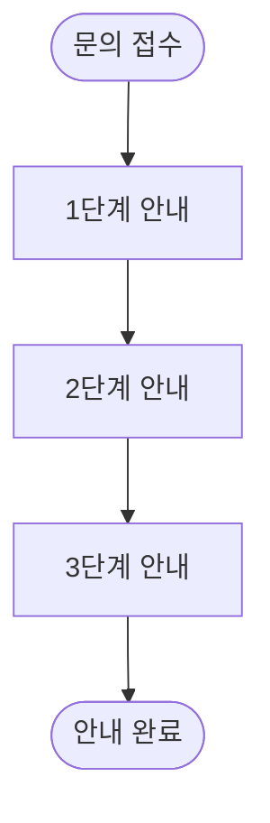

# [{SOP_ID}] {SOP_TITLE} - 플로우차트

> 이 플로우차트는 {SOP_ID} SOP의 {PURPOSE} 흐름을 시각화한 것입니다.

## 상담 흐름도

```mermaid
flowchart TD
    %% 시작 노드
    Start([고객 문의 접수<br/>{INQUIRY_TYPE}]) --> CheckInfo[기본 정보 확인]

    %% 정보 확인 단계
    CheckInfo --> AdminCheck[어드민 확인<br/>{ADMIN_CHECK_ITEMS}]
    AdminCheck --> CustomerCheck[고객 확인<br/>{CUSTOMER_CHECK_ITEMS}]

    CustomerCheck --> MainDecision{주요 의사결정<br/>{DECISION_CRITERIA}}

    %% 케이스별 분기 (TS 타입)
    MainDecision -->|케이스 1<br/>{CASE_1_CONDITION}| Case1[케이스1: {CASE_1_NAME}]
    MainDecision -->|케이스 2<br/>{CASE_2_CONDITION}| Case2[케이스2: {CASE_2_NAME}]
    MainDecision -->|케이스 3<br/>{CASE_3_CONDITION}| Case3[케이스3: {CASE_3_NAME}]
    %% 필요시 케이스 추가...

    %% 케이스 1 처리 흐름
    Case1 --> Action1[{CASE_1_ACTION}]
    Action1 --> Check1{해결<br/>여부?}
    Check1 -->|성공| Success1[{CASE_1_SUCCESS} ✅]
    Check1 -->|실패| NextStep1[{CASE_1_NEXT_STEP}]
    NextStep1 --> Transfer1[담당팀 전달<br/>{TRANSFER_TARGET_1}]

    %% 케이스 2 처리 흐름
    Case2 --> Action2[{CASE_2_ACTION}]
    Action2 --> Check2{조건<br/>확인?}
    Check2 -->|조건 충족| Success2[{CASE_2_SUCCESS} ✅]
    Check2 -->|조건 미충족| Alternative2[{CASE_2_ALTERNATIVE}]
    Alternative2 --> Success2A[대안 처리 완료]

    %% 케이스 3 처리 흐름
    Case3 --> Action3[{CASE_3_ACTION}]
    Action3 --> Success3[{CASE_3_SUCCESS} ✅]

    %% 종료 노드
    Success1 --> End([처리 완료])
    Success2 --> End
    Success2A --> End
    Success3 --> End
    Escalate1 --> TransferEnd[담당팀 전달]

    %% 스타일링
    classDef successClass fill:#d4edda,stroke:#28a745,stroke-width:2px
    classDef warningClass fill:#fff3cd,stroke:#ffc107,stroke-width:2px
    classDef dangerClass fill:#f8d7da,stroke:#dc3545,stroke-width:2px
    classDef infoClass fill:#d1ecf1,stroke:#17a2b8,stroke-width:2px
    classDef processClass fill:#e7f3ff,stroke:#0056b3,stroke-width:2px

    %% 색상 적용 (케이스별로 조정)
    class Success1,Success2,Success2A,Success3 successClass
    class Action1,Action2,Alternative2 warningClass
    class Transfer1,TransferEnd dangerClass
    class MainDecision,Check1,Check2 infoClass
    class CheckInfo,AdminCheck,CustomerCheck,Action3 processClass
```

## 케이스별 설명

### 🟢 정상 처리 (초록색)
- **케이스 1**: {CASE_1_DESCRIPTION}
- **케이스 2**: {CASE_2_DESCRIPTION}
- **케이스 3**: {CASE_3_DESCRIPTION}

### 🟡 주의 필요 / 조건부 처리 (노란색)
- {WARNING_CASES_DESCRIPTION}
- 조건 충족 시 처리 가능
- 추가 확인 필요

### 🔴 담당팀 전달 / 처리 불가 (빨간색)
- {TRANSFER_DESCRIPTION}
- {TARGET_TEAM}에 전달
- 특수 대응 필요

### 🔵 의사결정 포인트 (파란색)
- {DECISION_POINT_1}
- {DECISION_POINT_2}
- {DECISION_POINT_3}

### ⚙️ 정보 확인 단계 (연한 파란색)
- 어드민 정보 확인
- 고객 상황 확인
- 조건 검증

## 주요 체크포인트

| 단계 | 확인 사항 | 도구/방법 |
|------|----------|----------|
| 1️⃣ 문의 접수 | {CHECKPOINT_1} | {TOOL_1} |
| 2️⃣ 정보 확인 | {CHECKPOINT_2} | {TOOL_2} |
| 3️⃣ 조건 검증 | {CHECKPOINT_3} | {TOOL_3} |
| 4️⃣ 처리 진행 | {CHECKPOINT_4} | {TOOL_4} |
| 5️⃣ 완료/에스컬레이션 | {CHECKPOINT_5} | - |

## {ADDITIONAL_SECTION_TITLE} (선택 사항)

### {SUBSECTION_1}
{SUBSECTION_1_CONTENT}

### {SUBSECTION_2}
{SUBSECTION_2_CONTENT}

## 담당팀 전달 기준

| 조건 | 전달 대상 | 필수 정보 |
|------|----------|----------|
| {ESCALATION_CONDITION_1} | {ESCALATION_TARGET_1} | {ESCALATION_INFO_1} |
| {ESCALATION_CONDITION_2} | {ESCALATION_TARGET_2} | {ESCALATION_INFO_2} |
| {ESCALATION_CONDITION_3} | {ESCALATION_TARGET_3} | {ESCALATION_INFO_3} |

---

**생성 정보**:
- 원본 SOP: [{SOP_ID}_{SOP_TITLE}.sop.md](./{SOP_ID}_{SOP_TITLE}.sop.md)
- 생성일: {GENERATION_DATE}
- 플로우차트 버전: v1.0
- 데이터: {DATA_COUNT}건 ({DATA_PERCENTAGE}%)

---

## 템플릿 변수 가이드

### 필수 변수
- `{SOP_ID}`: SOP 식별자 (예: TS_001, HT_002)
- `{SOP_TITLE}`: SOP 제목 (예: AS접수_하드웨어진단)
- `{PURPOSE}`: SOP 목적 요약 (예: 하드웨어 문제 진단 및 AS 접수)
- `{INQUIRY_TYPE}`: 문의 유형 (예: PC 이상 증상 신고)

### 정보 확인 변수
- `{ADMIN_CHECK_ITEMS}`: 어드민에서 확인할 항목 (줄바꿈으로 구분)
- `{CUSTOMER_CHECK_ITEMS}`: 고객에게 확인할 항목 (줄바꿈으로 구분)

### 의사결정 변수
- `{DECISION_CRITERIA}`: 주요 의사결정 기준 (예: 증상 유형 확인)
- `{DECISION_POINT_N}`: 각 의사결정 포인트

### 케이스 변수 (반복 가능)
각 케이스마다:
- `{CASE_N_CONDITION}`: 케이스 진입 조건
- `{CASE_N_NAME}`: 케이스 이름
- `{CASE_N_ACTION}`: 수행할 액션
- `{CASE_N_SUCCESS}`: 성공 시 결과
- `{CASE_N_NEXT_STEP}`: 실패 시 다음 단계
- `{CASE_N_DESCRIPTION}`: 케이스 설명

### 체크포인트 변수 (5개 권장)
- `{CHECKPOINT_N}`: 체크포인트 설명
- `{TOOL_N}`: 사용할 도구/방법

### 담당팀 전달 변수
- `{TRANSFER_CONDITION_N}`: 담당팀 전달 조건
- `{TRANSFER_TARGET_N}`: 전달 대상 팀
- `{TRANSFER_INFO_N}`: 전달 시 필요 정보

### 메타데이터 변수
- `{GENERATION_DATE}`: 생성일 (YYYY-MM-DD)
- `{DATA_COUNT}`: 분석 대상 건수
- `{DATA_PERCENTAGE}`: 전체 대비 비율

## 색상 코딩 가이드

### 🟢 Success (초록색) - successClass
**사용 대상**:
- 문제 해결 완료
- 정상 처리 케이스
- 자가 진단 성공
- 조건 충족

**Mermaid 적용**:
```mermaid
class Success1,Success2,Success3 successClass
```

### 🟡 Warning (노란색) - warningClass
**사용 대상**:
- 주의 필요
- 조건부 처리
- 추가 확인 필요
- 비용 발생

**Mermaid 적용**:
```mermaid
class Action1,Alternative2 warningClass
```

### 🔴 Danger (빨간색) - dangerClass
**사용 대상**:
- 에스컬레이션
- 처리 불가
- 긴급 상황
- 고위험 조치

**Mermaid 적용**:
```mermaid
class Escalate1,NoAS dangerClass
```

### 🔵 Info (파란색) - infoClass
**사용 대상**:
- 의사결정 포인트
- 조건 확인
- 상태 검증
- 분기 지점

**Mermaid 적용**:
```mermaid
class MainDecision,Check1,Check2 infoClass
```

### ⚙️ Process (연한 파란색) - processClass
**사용 대상**:
- 정보 수집
- 데이터 확인
- 시스템 조회
- 준비 단계

**Mermaid 적용**:
```mermaid
class CheckInfo,AdminCheck,CustomerCheck processClass
```

## 노드 형태 가이드

### 시작/종료 노드
```mermaid
Start([시작 텍스트])
End([종료 텍스트])
```

### 의사결정 노드 (다이아몬드)
```mermaid
Decision{조건<br/>확인?}
```

### 프로세스 노드 (사각형)
```mermaid
Process[처리 내용]
```

### 다중 라인 노드
```mermaid
MultiLine[첫 번째 줄<br/>두 번째 줄<br/>세 번째 줄]
```

## Mermaid 작성 시 주의사항

### ❌ 피해야 할 것

1. **큰따옴표 사용**
   ```mermaid
   ❌ Node["고객님께 "안내""]
   ✅ Node[고객님께 안내]
   ```

2. **이모티콘 (특수 문자)**
   ```mermaid
   ❌ End([감사합니다 :)])
   ✅ End([감사합니다])
   ✅ End([감사합니다 😊])  # 이모지는 OK
   ```

3. **특수 문자**
   ```mermaid
   ❌ Node[금액: $100]  # $ 문제 가능
   ✅ Node[금액: 100달러]
   ```

4. **너무 긴 텍스트**
   ```mermaid
   ❌ Node[이것은 매우 긴 텍스트로 노드가 너무 커져서 플로우차트 가독성이 떨어집니다]
   ✅ Node[간단한 설명<br/>상세는 하단 표 참조]
   ```

### ✅ 권장 사항

1. **짧고 명확한 노드 텍스트**
   - 한 줄당 15자 이내 권장
   - 줄바꿈(`<br/>`)으로 분할

2. **일관된 네이밍**
   - 케이스: `Case1`, `Case2`, ...
   - 성공: `Success1`, `Success2`, ...
   - 체크: `Check1`, `Check2`, ...

3. **색상 그룹화**
   - 같은 의미는 같은 색상
   - 한 플로우차트에 5가지 색상 이내

4. **화살표 라벨 활용**
   ```mermaid
   Decision -->|예| YesPath
   Decision -->|아니오| NoPath
   ```

## 플로우차트 복잡도 가이드

### Simple (5-10 nodes)
- 시작 → 의사결정 → 2-3개 케이스 → 종료
- 간단한 How-To SOP용

### Standard (15-30 nodes) - 권장
- 시작 → 정보확인 → 주요의사결정 → 4-6개 케이스 → 케이스별 처리 → 종료
- 대부분의 TS SOP용

### Detailed (30+ nodes)
- 모든 분기와 예외 상황 포함
- 복잡한 multi-step 프로세스
- 교육용 상세 자료

## 템플릿 사용 예시

### TS (Troubleshooting) SOP용

**변수 매핑**:
```yaml
SOP_ID: TS_001
SOP_TITLE: AS접수_하드웨어진단
PURPOSE: 하드웨어 문제 진단 및 AS 접수
INQUIRY_TYPE: PC 이상 증상 신고
ADMIN_CHECK_ITEMS: 주문번호/출장라이센스/AS이력
CUSTOMER_CHECK_ITEMS: 증상/발생시점/최근변경사항
DECISION_CRITERIA: 증상 유형
CASE_1_CONDITION: PC 꺼짐
CASE_1_NAME: PC 전원 문제
CASE_1_ACTION: 자가 진단 안내<br/>전원/청소/메모리
...
```

### HT (How-To) SOP용

**구조 차이**:
- 의사결정보다는 **절차적 흐름**
- 조건 분기 적음
- 주로 안내 단계 나열

**간소화된 구조**:


## 파일명 규칙

### 플로우차트 Markdown
```
{SOP_ID}_{SOP_TITLE}_FLOWCHART.md

예시:
- TS_001_AS접수_하드웨어진단_FLOWCHART.md
- HT_002_견적상담_구매안내_FLOWCHART.md
```

### 플로우차트 SVG
```
{SOP_ID}_flowchart-1.svg

예시:
- TS_001_flowchart-1.svg
- HT_002_flowchart-1.svg
```

**Note**: `-1` 접미사는 Mermaid CLI가 자동으로 추가

## 품질 체크리스트

### 플로우차트 구조
- [ ] 시작 노드 명확
- [ ] 모든 케이스 포함
- [ ] 의사결정 포인트 다이아몬드 사용
- [ ] 종료 노드 명확
- [ ] 고아 노드 없음 (연결 안된 노드)

### 색상 코딩
- [ ] 5가지 색상 일관성 유지
- [ ] 케이스별 적절한 색상 배정
- [ ] 에스컬레이션은 빨간색
- [ ] 성공은 초록색

### 가독성
- [ ] 한 화면에 전체 표시 가능
- [ ] 노드 텍스트 짧고 명확
- [ ] 화살표 교차 최소화
- [ ] 분기 조건 명확

### 문서화
- [ ] 케이스별 설명 완전
- [ ] 체크포인트 테이블 작성
- [ ] 에스컬레이션 기준 명시
- [ ] 메타데이터 정확

### SVG 변환
- [ ] Mermaid 구문 오류 없음
- [ ] SVG 파일 생성 성공
- [ ] 파일 크기 적절 (100-200KB)
- [ ] 이미지 잘림 없음

## 버전 관리

### v1.0 (초기 버전)
- 기본 플로우차트 구조
- 5가지 색상 코딩
- 케이스별 설명

### 향후 개선 (v1.1+)
- 인터랙티브 플로우차트 (클릭 가능)
- 다국어 버전 (영어/일본어)
- 통계 정보 오버레이
- PDF 출력 지원

---

**템플릿 사용 시**:
1. 변수를 실제 값으로 치환
2. 불필요한 케이스 제거 또는 추가
3. 색상 코딩 조정
4. Mermaid 구문 검증
5. SVG 변환 테스트
