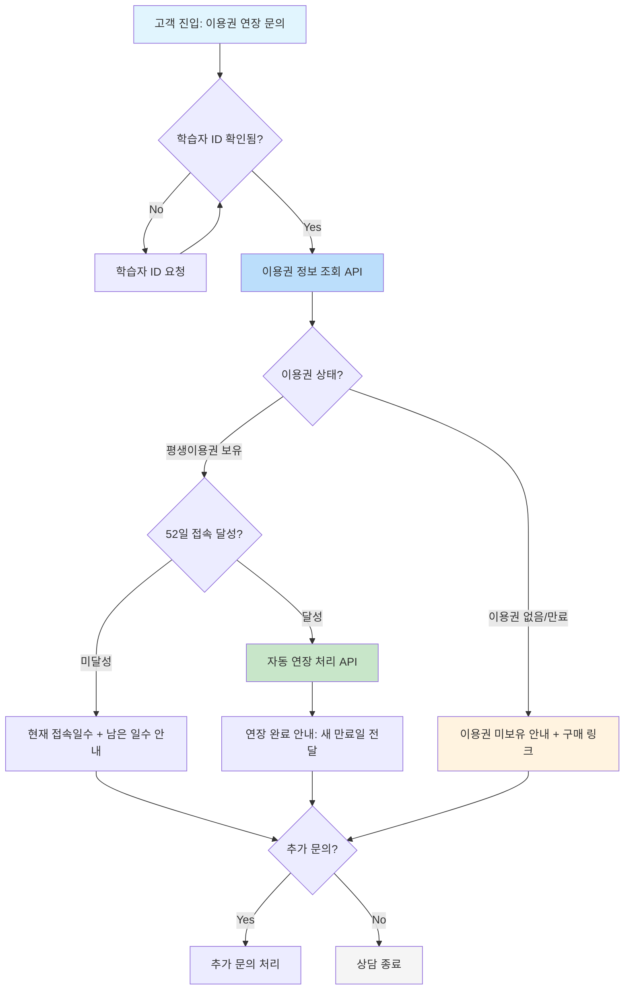
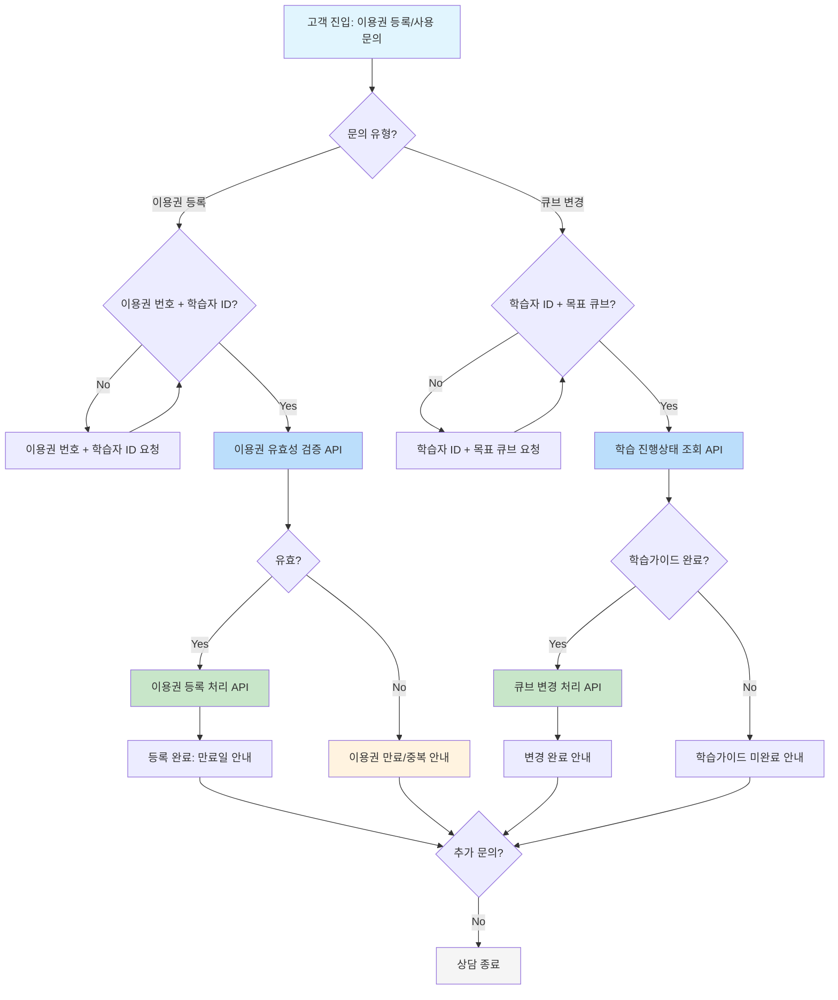
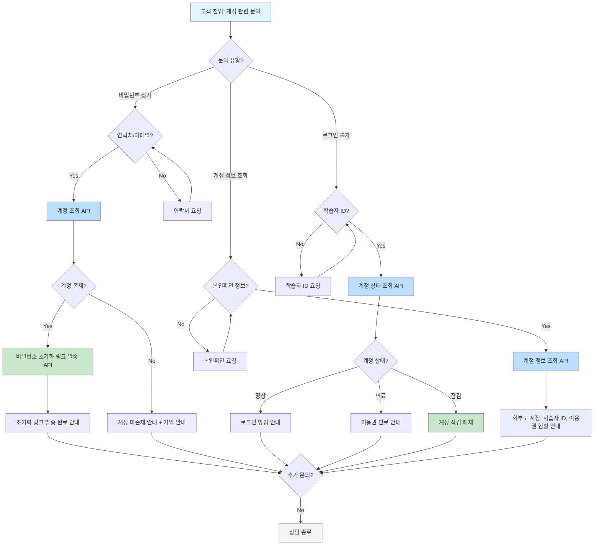
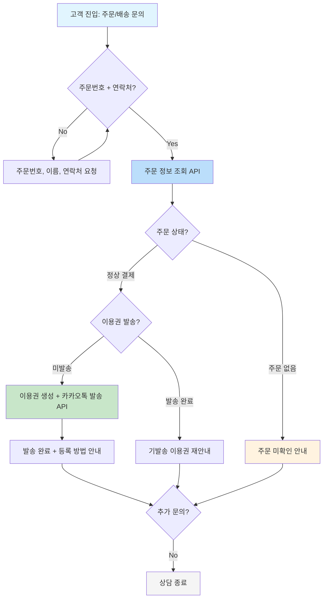
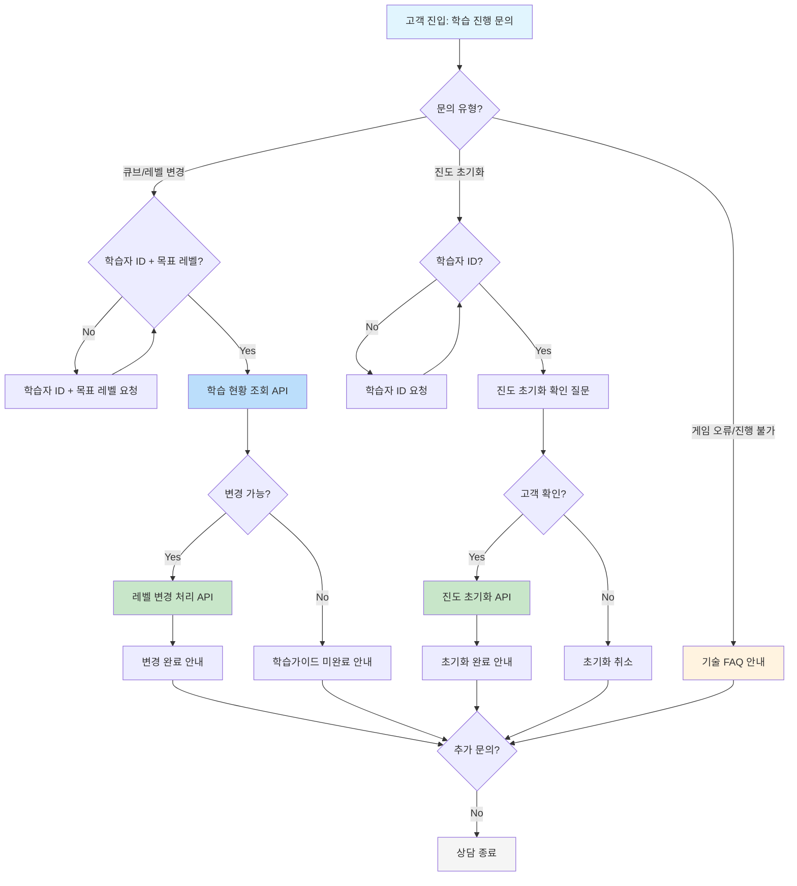

# 호두랩스 고객센터 최종 분석 리포트

> **분석 기간**: 최근 90일
**분석일**: 2026-02-24
**데이터 출처**: 채널톡 내보내기 (Excel, UserChat data + Message data)
**프레임워크**: 상담주제 x 대화유형 2차원 교차분석 (ver. Rosa)
> 

---

## 1. 데이터 개요

### 1-1. 원천 데이터

| 항목 | 수치 |
| --- | --- |
| 전체 케이스 | **2,229건** |
| 닫힌 케이스 | 2,169건 |
| 분석 대상 (발화 보유) | **2,110건** |
| 전체 메시지 | 23,961건 |

### 1-2. 운영 현황

| 항목 | 내용 |
| --- | --- |
| **상담사** | 2명 (Mio, rose) |
| **채널** | 채널톡 53.1% / 카카오톡 43.9% / 전화 2.9% |
| **주요 서비스** | 영어 학습 프로그램 (호두PC, 톡트리, 베티아잉글리시, 호두ABC, 호두M, bookr, 링키) |
| **핵심 상품** | 호두PC 평생이용권 (52일 접속 시 매년 자동 갱신) |
| **판매 채널** | 쿠팡 라이브, 도치맘/뺑구닷컴 등 공구, 호두스쿨 홈페이지 |

### 1-3. 특이사항

- **워크플로우 봇**: 봇이 먼저 안내 → 고객 “네” 응답 → 실제 문의 시작 (첫 발화가 단답인 케이스 36%)
- **분류 방식**: 첫 발화 키워드 → 전체 발화 fallback → summarizedMessage fallback 순서로 분류
- **단순응대**: 실질 상담 없이 종료된 케이스 127건(6.0%) 별도 분류

---

## 2. 상담주제 분포 (X축)

| # | 상담주제 | 건수 | 비율 | 주요 키워드 |
| --- | --- | --- | --- | --- |
| 1 | **이용권등록/구매** | 407 | **19.3%** | 이용권, 등록, 구매, 평생이용권, 결제, 코드 |
| 2 | **PC설치/오류** | 377 | **17.9%** | 설치, 마이크, 오류, 다운로드, 프로그램, 화면 |
| 3 | **이용권연장** | 306 | **14.5%** | 연장, 만료, 52일, 갱신, 접속일 |
| 4 | **계정/로그인** | 290 | **13.7%** | 아이디, 비밀번호, 로그인, 계정, 양도 |
| 5 | **배송/주문처리** | 181 | 8.6% | 쿠팡, 주문번호, 안심번호, 배송, 도치맘 |
| 6 | **학습진행/레벨** | 165 | 7.8% | 레벨, 큐브, 진도, 스토리, 게임, 초기화 |
| 7 | **단순응대** | 127 | 6.0% | 실질 상담 없이 종료 (단답/부재) |
| 8 | **타제품문의** | 77 | 3.6% | 톡트리, 베티아, ABC, 호두M, bookr, 링키 |
| 9 | **취소/환불** | 63 | 3.0% | 환불, 취소, 반품 |
| 10 | **기타** | 56 | 2.7% | 미분류 |
| 11 | **무료체험** | 39 | 1.8% | 무료, 체험, 체험권, 엘리하이 |
| 12 | **상품/가격문의** | 22 | 1.0% | 금액, 가격, 추천, 연령, 비교 |

> **기타 비율 2.7%** - 품질 게이트 통과 (< 10%)
> 

### 핵심 인사이트

> 이용권 관련 합계 = 등록/구매(19.3%) + 연장(14.5%) = 전체의 **33.8%**
호두랩스 고객센터 업무의 1/3이 “이용권 관리” → 이용권 API 연동만으로 대폭 자동화 가능
> 

> PC 관련 합계 = 설치/오류(17.9%) + 학습/레벨(7.8%) = 전체의 **25.7%**
윈도우 전용 프로그램 특성상 기술 문의가 높음 → FAQ 문서 + 원격지원 가이드로 RAG 자동화
> 

---

## 3. 대화유형 분포 (Y축)

| # | 대화유형 | 건수 | 비율 | 정의 | AI 처리 방식 |
| --- | --- | --- | --- | --- | --- |
| 1 | **지식응답** | 515 | 24.4% | FAQ 질문 (“어떻게 하나요?”) | RAG |
| 2 | **정보조회** | 84 | 4.0% | 데이터 확인 요청 (“주문번호 확인”) | Task (조회 API) |
| 3 | **단순실행** | 454 | **21.5%** | 명확한 처리 요청 (“연장해주세요”) | Task (실행 API) |
| 4 | **정책확인** | 633 | **30.0%** | “~도 되나요?” 질문 | RAG + 분기 |
| 5 | **조건부실행** | 27 | 1.3% | 조건 포함 실행 요청 | Task + 정책 분기 |
| 6 | **의도불명확** | 393 | 18.6% | 모호한 발화 | 명확화 질문 |
| 7 | **상담사전환** | 4 | 0.2% | 감정/클레임 | 상담사 즉시 연결 |

> **의도불명확 18.6%** - 품질 게이트 통과 (< 25%)
> 

### 자동화 가능성 요약

| 구분 | 대화유형 | 비율 | 자동화 |
| --- | --- | --- | --- |
| 🟢 즉시 자동화 | 지식응답 + 정보조회 + 단순실행 | **49.9%** | RAG + Task |
| 🟡 정책 정비 후 | 정책확인 + 조건부실행 | **31.3%** | RAG + Task + 분기 |
| ⚪ 명확화 | 의도불명확 | **18.6%** | 명확화 질문 시나리오 |
| 🔴 자동화 불가 | 상담사전환 | **0.2%** | 상담사 필수 |

---

## 4. 상담주제 x 대화유형 교차분석

### 4-1. 히트맵

### 4-2. Top 10 고빈도 조합

| 순위 | 상담주제 x 대화유형 | 건수 | 비율 | 평균턴수 | 평균처리시간 | 자동화 방식 |
| --- | --- | --- | --- | --- | --- | --- |
| 1 | **이용권등록/구매 x 정책확인** | 145 | **6.9%** | 4.8턴 | 8h35m | RAG (정책 문서) |
| 2 | **PC설치/오류 x 지식응답** | 122 | **5.8%** | 4.2턴 | 11h49m | RAG (기술 FAQ) |
| 3 | **단순응대 x 의도불명확** | 118 | **5.6%** | 0.8턴 | 14h41m | 자동 종료/명확화 |
| 4 | **PC설치/오류 x 정책확인** | 115 | **5.5%** | 7.4턴 | 16h01m | RAG (기술 FAQ) |
| 5 | **이용권연장 x 단순실행** | 99 | 4.7% | 6.7턴 | 6h18m | **Task** (연장 API) |
| 6 | **이용권등록/구매 x 지식응답** | 94 | 4.5% | 2.8턴 | 9h54m | RAG (이용권 FAQ) |
| 7 | **이용권연장 x 정책확인** | 88 | 4.2% | 5.4턴 | 8h48m | RAG (연장 정책) |
| 8 | **이용권연장 x 지식응답** | 84 | 4.0% | 2.8턴 | 12h32m | RAG (연장 FAQ) |
| 9 | **이용권등록/구매 x 단순실행** | 81 | 3.8% | 6.0턴 | 11h19m | **Task** (등록 API) |
| 10 | **계정/로그인 x 지식응답** | 76 | 3.6% | 3.7턴 | 12h05m | RAG (계정 FAQ) |

### 4-3. 셀 해석

> **1위: 이용권등록/구매 x 정책확인 = 6.9% (4.8턴)**
“평생이용권 구매했는데 언제까지 등록하면 되나요?”
“1개월 체험 후 평생권 사면 진도 이어가나요?”
→ RAG: 이용권 정책 문서로 즉시 응답 가능
> 

> **2위: PC설치/오류 x 지식응답 = 5.8% (4.2턴)**
“호두PC 설치가 안돼요” / “마이크 인식이 안됩니다”
→ RAG: 설치 가이드 + 오류 해결 FAQ
> 

> **5위: 이용권연장 x 단순실행 = 4.7% (6.7턴)**
“평생이용권 연장해주세요” + 학습자ID 제공
→ Task: 접속일수 조회 → 자동 연장 API
> 

> **9위: 이용권등록/구매 x 단순실행 = 3.8% (6.0턴)**
“이용권 번호 등록해주세요” + 이용권코드 제공
→ Task: 이용권 검증 → 등록 API
> 

---

## 5. Task 자동화 시나리오 (프로세스 플로우)

> Top 10 중 단순실행/정보조회: **이용권연장(4.7%)**, **이용권등록(3.8%)**, **계정/로그인(2.7%)**, **배송/주문(2.1%+1.3%)**, **학습진행(1.6%)**
> 

### 5-1. 이용권연장 x 단순실행 (4.7% | 99건)

**대표 패턴**:
- “평생이용권 연장 문의드립니다” + 학습자 ID
- 52일 접속 조건 충족 확인 → 자동 연장

**필수 수집 정보**:

| 정보명 | 추출 패턴 | 필수 |
| --- | --- | --- |
| 학습자 ID | 영문+숫자 | O |
| 연락처 | 010-XXXX-XXXX | O |

**현재 vs 자동화 비교**:

| 항목 | 현재 (상담사) | 자동화 후 |
| --- | --- | --- |
| 평균 턴수 | 6.7턴 | 1~2턴 |
| 평균 처리시간 | 6시간 18분 | 즉시 (~30초) |
| 처리 단계 | ID 확인 → 시스템 조회 → 수동 연장 → 안내 | ID 자동 추출 → API 조회 → 자동 연장 |
| 필요 API | - | `GET /learner/{id}/voucher`, `POST /voucher/{id}/extend` |

---

### 5-2. 이용권등록/구매 x 단순실행 (3.8% | 81건)

**대표 패턴**:
- “이용권 등록해주세요” + 이용권 번호
- 큐브(레벨) 변경 요청
- 체험 → 정식 전환 (진도 유지)

**필수 수집 정보**:

| 정보명 | 추출 패턴 | 필수 |
| --- | --- | --- |
| 이용권 번호 | 영문+숫자 코드 (FJG36UKNHMV) | O |
| 학습자 ID | 영문+숫자 | O |
| 큐브 변경 | “X.X큐브로 변경” | 선택 |

**현재 vs 자동화 비교**:

| 항목 | 현재 (상담사) | 자동화 후 |
| --- | --- | --- |
| 평균 턴수 | 6.0턴 | 2턴 |
| 평균 처리시간 | 11시간 19분 | 즉시 (~1분) |
| 필요 API | - | `GET /voucher/{code}/validate`, `POST /voucher/{code}/register`, `POST /learner/{id}/cube-change` |

---

### 5-3. 계정/로그인 x 단순실행 (2.7% | 56건)

**대표 패턴**:
- 비밀번호 분실 → 계정 조회 → 초기화
- 로그인 불가 → 계정 상태 확인
- 학습자 ID/이메일 찾기

**현재 vs 자동화 비교**:

| 항목 | 현재 (상담사) | 자동화 후 |
| --- | --- | --- |
| 평균 턴수 | 6.2턴 | 2턴 |
| 평균 처리시간 | 8시간 2분 | 즉시 (~1분) |
| 필요 API | - | `GET /account/search`, `POST /account/{id}/reset-password`, `GET /learner/{id}/status` |

---

### 5-4. 배송/주문처리 x 정보조회+단순실행 (3.4% | 72건)

**대표 패턴**:
- 쿠팡 라이브 주문 → 안심번호로 발송 불가 → 주문번호+연락처 제공 → 이용권 번호 발송
- 이용권 번호 수신 확인

**현재 vs 자동화 비교**:

| 항목 | 현재 (상담사) | 자동화 후 |
| --- | --- | --- |
| 평균 턴수 | 정보조회 1.7턴 / 단순실행 5.0턴 | 1~2턴 |
| 평균 처리시간 | 5h06m / 8h56m | 즉시 |
| 필요 API | - | `GET /order/{orderNo}`, `POST /voucher/issue`, `POST /notification/kakao` |

---

### 5-5. 학습진행/레벨 x 단순실행 (1.6% | 33건)

**대표 패턴**:
- 큐브 변경 요청 / 진도 초기화 / 레벨 변경
- 게임 오류 → 진행 불가 → 리셋 요청

**현재 vs 자동화 비교**:

| 항목 | 현재 (상담사) | 자동화 후 |
| --- | --- | --- |
| 평균 턴수 | 5.1턴 | 2턴 |
| 평균 처리시간 | 7시간 | 즉시 |
| 필요 API | - | `GET /learner/{id}/progress`, `POST /learner/{id}/cube-change`, `POST /learner/{id}/reset` |

---

### 5-종합. 필요 API 및 시스템 정리표

| # | 시나리오 | 비율 | 필요 API | 필요 데이터/시스템 |
| --- | --- | --- | --- | --- |
| 1 | 이용권연장 | 4.7% | `GET /learner/{id}/voucher` | 학습자 DB |
|  |  |  | `POST /voucher/{id}/extend` | 이용권 관리 시스템 |
| 2 | 이용권등록 | 3.8% | `GET /voucher/{code}/validate` | 이용권 코드 DB |
|  |  |  | `POST /voucher/{code}/register` | 이용권 관리 시스템 |
|  |  |  | `POST /learner/{id}/cube-change` | 학습 진행 DB |
| 3 | 계정/로그인 | 2.7% | `GET /account/search` | 계정 DB |
|  |  |  | `POST /account/{id}/reset-password` | 인증 시스템 |
| 4 | 배송/주문 | 3.4% | `GET /order/{orderNo}` | 주문 DB (쿠팡 연동) |
|  |  |  | `POST /voucher/issue` | 이용권 발급 시스템 |
|  |  |  | `POST /notification/kakao` | 카카오 알림톡 |
| 5 | 학습진행 | 1.6% | `GET /learner/{id}/progress` | 학습 진행 DB |
|  |  |  | `POST /learner/{id}/reset` | 학습 DB |

**공통 필수 API**:
- `GET /learner/{id}/info` — 학습자 기본 정보 조회
- `POST /notification/kakao` — 카카오톡 알림 발송

---

## 6. 자동화 전략

### 6-1. 대화유형별 자동화 가능성

| 대화유형 | 건수 | 비율 | 처리 방식 | 난이도 |
| --- | --- | --- | --- | --- |
| 1.지식응답 | 515 | 24.4% | RAG (FAQ) | 🟢 쉬움 |
| 2.정보조회 | 84 | 4.0% | Task (조회 API) | 🟢 쉬움 |
| 3.단순실행 | 454 | 21.5% | Task (실행 API) | 🟡 중간 |
| 4.정책확인 | 633 | 30.0% | RAG + 분기 | 🟡 중간 |
| 5.조건부실행 | 27 | 1.3% | Task + 정책 | 🟠 복잡 |
| 6.의도불명확 | 393 | 18.6% | 명확화 질문 | 🟡 중간 |
| 7.상담사전환 | 4 | 0.2% | 상담사 연결 | 🔴 불가 |

### 6-2. 자동화 로드맵

### Phase 1: 즉시 자동화 (RAG + Task 기본) — **49.9%**

| 대상 | 방식 | 필요 작업 |
| --- | --- | --- |
| 지식응답 전체 (515건) | RAG | 제품별 FAQ 문서 5종 정비 |
| 정보조회 전체 (84건) | Task | 조회 API 3개 연동 |
| 단순실행 (454건) | Task | 이용권 연장/등록/계정 API |

### Phase 2: 정책 기반 — 추가 **31.3%**

| 대상 | 방식 | 필요 작업 |
| --- | --- | --- |
| 정책확인 (633건) | RAG + 분기 | 이용권/환불 정책 문서 정비 |
| 조건부실행 (27건) | Task + 정책 | 정책 엔진 + API |

### Phase 3: 의도 명확화 — 추가 **18.6%**

| 대상 | 방식 | 필요 작업 |
| --- | --- | --- |
| 의도불명확 (393건) | 명확화 질문 → Phase 1/2 | 대화 시나리오 설계 |

### 6-3. 자동화 효과 예측

| 지표 | 현재 | Phase 1 후 | 전체 자동화 후 |
| --- | --- | --- | --- |
| **자동화 커버리지** | 0% | **49.9%** | **99.8%** |
| **월간 상담 건수** (90일 환산) | ~703건/월 | ~352건/월 | ~1건/월 |
| **상담사 업무량 절감** | - | ~50% | ~99% |
| **필요 상담사** | 2명 | 1명 | 파트타임 1명 |

---

## 7. 추가 발견사항

- **쿠팡 라이브 특수 패턴**: 안심번호로 이용권 발송 실패 → 고객이 직접 정보 제공 → 수동 발송. 쿠팡 주문 API 연동으로 자동화 가능
- **52일 접속 조건 혼란**: 연장 문의의 상당수가 조건 자체에 대한 질문 → FAQ로 선제 안내 시 문의 자체 감소
- **다제품 혼란**: 7종 제품(호두PC/M/ABC, 톡트리, 베티아, bookr, 링키) → 학습자 ID로 현재 사용 제품 자동 식별 필요
- **정책확인 30.0%로 높음**: “~도 되나요?” 패턴이 많은 것은 이용권/학습 관련 정책이 복잡하다는 의미 → 정책 문서 정비가 자동화의 핵심

---

## 8. 우선순위 권고 (ROI 기준)

| 순위 | 시나리오 | 건수/월 | ROI 근거 | 난이도 |
| --- | --- | --- | --- | --- |
| **1** | 이용권 FAQ (RAG) | ~180건 | 이용권등록+연장 관련 지식응답+정책확인 = 최대 볼륨 | 🟢 |
| **2** | 이용권연장 Task | ~33건 | 패턴 정형화, API 단순, 턴수 절감 효과 큼 | 🟢 |
| **3** | PC설치/오류 FAQ (RAG) | ~79건 | 설치 가이드 문서만으로 자동 응답 가능 | 🟢 |
| **4** | 이용권등록 Task | ~27건 | 이용권 코드 검증+등록 API | 🟡 |
| **5** | 배송/주문 Task | ~24건 | 쿠팡 주문 연동 + 카카오 알림 | 🟡 |
| **6** | 계정/로그인 Task | ~19건 | 비밀번호 초기화 자동화 | 🟡 |

---

## 9. 요약

| 항목 | 값 |
| --- | --- |
| 분석 케이스 | 2,110건 |
| 상담주제 | 12개 카테고리 (기타 2.7%) |
| 대화유형 | 7개 유형 (의도불명확 18.6%) |
| **자동화 가능 비율** | **79.9%** (1~4유형) |
| **핵심 자동화 대상** | 이용권 관련 FAQ/Task (33.8%) + PC기술 FAQ (17.9%) |
| **필요 API** | 약 12개 엔드포인트 |
| **예상 인력 절감** | 상담사 2명 → 1명 (50% 감소, Phase 1) |

> **핵심 메시지**: 호두랩스 CS의 핵심은 **이용권 관리**(33.8%)와 **PC 기술지원**(25.7%). 이용권 정책 FAQ 문서 정비 + 이용권 API 연동으로 Phase 1만으로도 상담의 절반을 자동화할 수 있습니다.
> 

---

*분석 도구: Claude Code (CS EDA 프레임워크)분석 방법론: 상담주제 x 대화유형 2차원 교차분석 (ver. Rosa)*